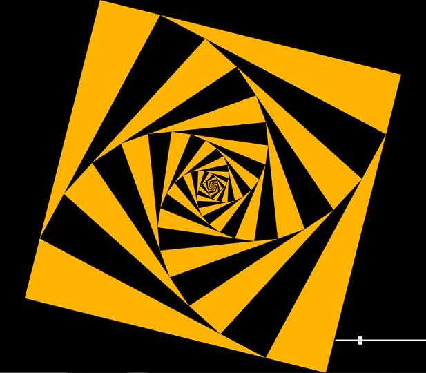

# A Spiral of nested squares

An interactive geometrical art experience featuring nested squares. Each nested square is rotated by a fixed degree with respect to the container square. The rotation angle can be changed with the range slider.

Note that the HTML5 range slider does not work in mobile safari &mdash; and I'm not willing to do a workaround. Just use a decent browser such as Chrome.
